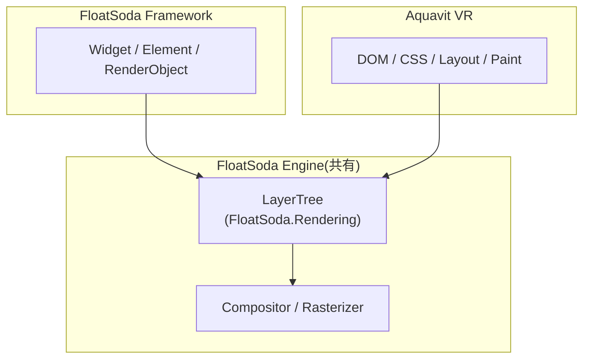

← [Home](Home.md)

# Architecture

Aquavit VR は、FloatSoda の描画エンジンを利用する独立した Web UI フレームワークです。UI モデルは DOM / CSS / Layout / Paint で構成し、描画結果を FloatSoda の LayerTree に変換します。

## 共有境界

FloatSoda と共有するのは LayerTree 以下です。FloatSoda の Widget / Element / RenderObject は、Aquavit VR の UI モデルに使いません。

## 依存ルール

| ルール | 理由 |
|---|---|
| `src/Aquavit` が参照する FloatSoda のパッケージは `FloatSoda.Rendering` だけにする | 共有境界を LayerTree 以下に保つため |
| `Widget` / `Element` / `RenderObject` / `BuildContext` / `Key` を共有範囲に含めない | これらは FloatSoda の UI モデルであり、Aquavit VR の UI モデルは DOM であるため |
| FloatSoda は NuGet の `PackageReference` で参照する | 公開リポジトリと CI で、ローカルのフォルダ配置に依存せずにビルドするため |

> **実装状況** — 依存ルールは、現在は `src/Aquavit/Aquavit.csproj` の記述だけで守っています。ビルドやテストで自動検査する仕組みは [#6](https://github.com/sumx21t-3310/Aquavit-VR/issues/6) で追加します。

FloatSoda 側の変更が必要になった場合は、FloatSoda のリポジトリで変更し、リリースされたバージョンを参照します。Engine 層に残っている Framework 固有の依存は [#9](https://github.com/sumx21t-3310/Aquavit-VR/issues/9) で洗い出します。

## 利用する Layer

`FloatSoda.Rendering` 0.3.1 の `FloatSoda.Rendering.Layers` 名前空間にある型を使います。

| 型 | 役割 |
|---|---|
| `ILayer` | LayerTree の要素。`Layout` で描画境界を確定し、`Paint` で描画します |
| `ContainerLayer` | 子 Layer を保持し、一覧の順に描画します |
| `PictureLayer` | 記録済みの `SKPicture` を描画します |
| `TransformLayer` | 子に `SKMatrix` の変換を適用します |
| `OpacityLayer` | 子を指定した Alpha で描画します |
| `ClipRectLayer` / `ClipRoundRectLayer` / `ClipPathLayer` | 子の描画範囲を切り抜きます |
| `LayerContext` | 描画先の `SKCanvas` を保持します |

組み立て方の例は `samples/Aquavit.Samples.LayerTree/Program.cs` にあります。

## 処理の流れ(予定)

Phase 1 以降で、次の順に処理する構成を実装します。

| 段階 | Issue |
|---|---|
| DOM Tree | [#10](https://github.com/sumx21t-3310/Aquavit-VR/issues/10) |
| Style 解決 | [#11](https://github.com/sumx21t-3310/Aquavit-VR/issues/11) |
| Layout | [#12](https://github.com/sumx21t-3310/Aquavit-VR/issues/12)、[#13](https://github.com/sumx21t-3310/Aquavit-VR/issues/13)、[#14](https://github.com/sumx21t-3310/Aquavit-VR/issues/14) |
| Paint と LayerTree への変換 | [#13](https://github.com/sumx21t-3310/Aquavit-VR/issues/13) |
